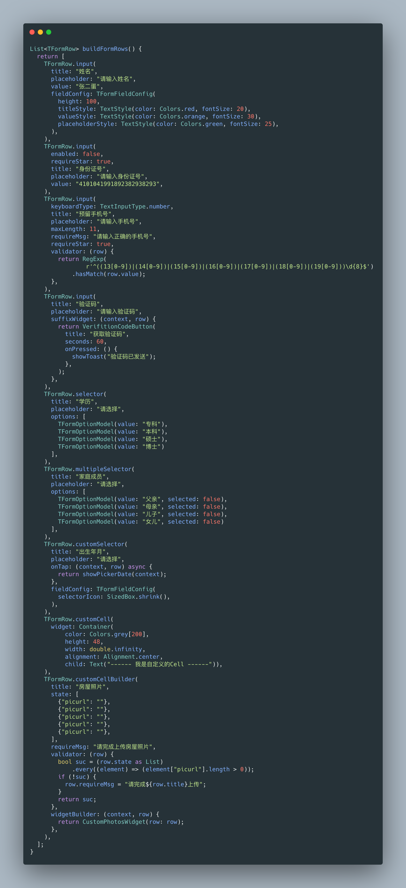
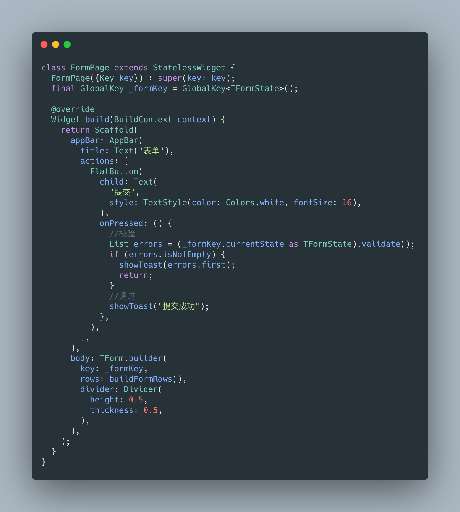

# tform
拉去自大佬的 tform 1.0.1 ，现支持flutter3.0 原作者地址 
flutter 3.0 support

## Installing
Add this to your package's pubspec.yaml file:

```yaml
dependencies:
  echo_tform: ^0.0.1
```

## source from tform

```
https://github.com/yichahucha/tform
```

## Example


## Build Form Rows


## Build Form

